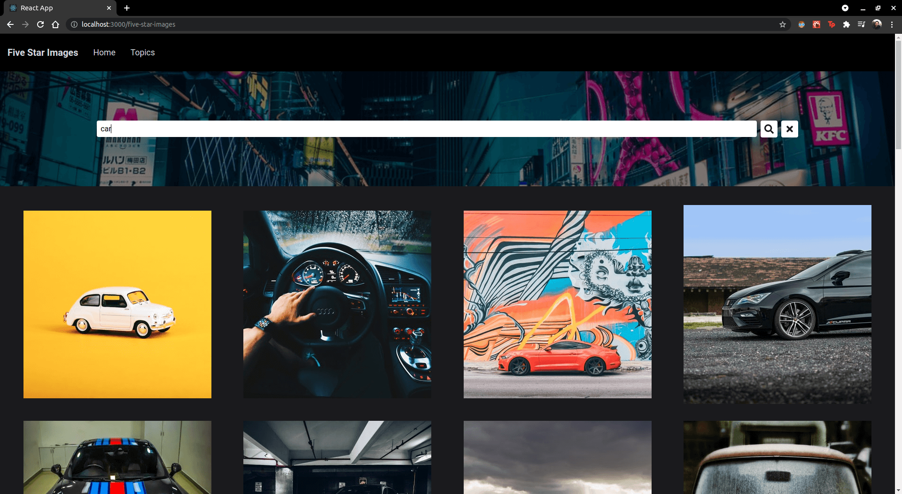

# React-Redux Capstone

This project will be submitted as my Microverse React Capstone project. It uses the Unsplash API to query images, stores them in Redux global storage and then uses that storage to render images to the display.


## Screenshot



  
## Demo

[Click here to view the live demo](https://ryelbanfield.github.io/five-star-images/)
## Run Locally

Clone the project

```bash
  git clone https://github.com/RyelBanfield/five-star-images.git
```

Go to the project directory

```bash
  cd my-project
```

Install dependencies

```bash
  npm i
```

Run tests

```bash
  npm run test
```

Start the server

```bash
  npm run start
```

  ## 👤 Author
**Ryel Banfield**
- [GitHub](https://github.com/ryelbanfield)
- [Twitter](https://twitter.com/ryelbanfield)
- [LinkedIn](https://www.linkedin.com/in/ryel-banfield/)

## 📝 License
This project is [MIT](LICENSE) licensed.